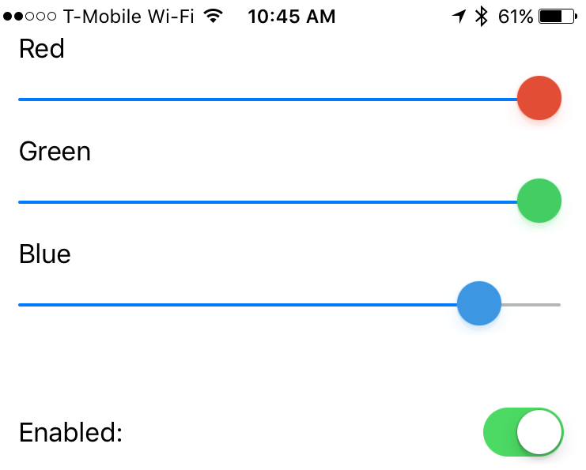

#  Rootless Color -- A color calibration tool for iOS

If you are using a non-OEM display or one installed by a non-Apple approved 3rd party your color is likely horribly messed up since these cheap, low quality panels have no calibration done on them what so ever.

I bought an $18.99 screen for my iPhone off ebay and while it worked it was grossly blue. Built this simple app (not really, stole the [GammaController](https://github.com/thomasfinch/GammaThingy) from GammaThingy) to set the percent R G and B. Fixed it right up!

Some things to note:

1. You will need to reopen the app every time your device starts up. Calibration is saved, you just need to open to apply.
2. The sliders are touchy. If you have a very specific value (i.e. you used a colorimeter) I'd recommend modifying the `viewDidLoad` to contain just `[GammaController setGammaWithRed:<red> green:<green> blue:<blue>];`. Obviously replacing the `<tokens>` with your float values.
3. Nightshift works just fine with this. You will be changing the color that nightshift goes to as well here so if you make it really orange now it'll be very very orange at night.

### Installing

Since this app will never go on the store you'll need to sign the app yourself. Easiest way to do this is just use Xcode and build and run and it'll take care of everything for you. If you aren't a registered and paying developer you'll have to rebuild every week.

If you happen to have some other signing service (usually piracy so I won't name them) you can use one of the prebuilt ipa from the releases tab on this repo. Each of these services handles it differently so you'll need to figure this out.